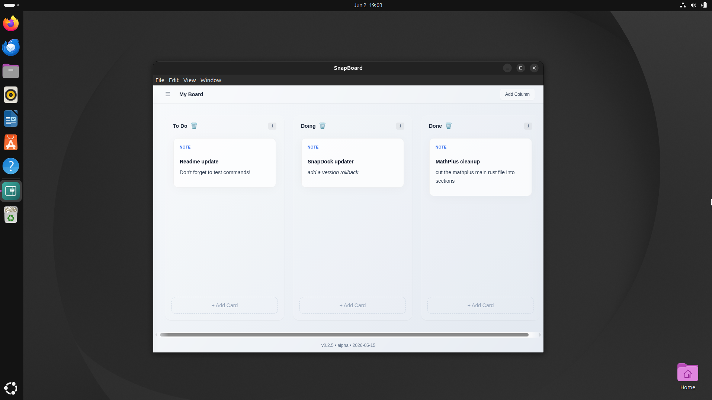

<!-- ========================================================= -->
<!-- Standards Approval Badge -->
<!-- ========================================================= -->

<table align="right">
  <tr>
    <td>
      
    </td>
  </tr>
</table>

<!-- ========================================================= -->

<!-- Required Badges -->

<!-- ========================================================= -->

[](https://docs.zford.dev)


<!-- ========================================================= -->

<!-- Optional Badges (Uncomment if applicable) -->

<!-- ========================================================= -->

<!-- [](https://zforddev.itch.io/snapBoard) -->


# SnapBoard

> A lightweight, local‑first kanban board built for the SnapDock ecosystem.  
> **Status:** Alpha • Actively Developed • Accepting Contributions

---

## Why This Exists

SnapBoard was created to provide a **fast, local‑first planning tool** that fits naturally into the SnapDock ecosystem.  
It focuses on simple workflows, clean interaction, and zero cloud dependencies — ideal for developers, creators, and anyone who prefers **local control** over their planning tools.

SnapBoard is *not* a full project‑management suite, a Trello clone, or a cloud service.  
It’s a **minimal, offline‑ready board** designed for personal workflow clarity.

---

## Overview

SnapBoard provides a clean, distraction‑free kanban experience with:

- multiple boards  
- dynamic columns  
- drag‑and‑drop cards  
- markdown‑based card content  
- file attachments  
- persistent JSON storage  
- a stable, portable Electron‑based desktop workflow  

The long‑term vision includes optional SnapDock integration and a re‑evaluation of the original slide‑out dock panel concept.

SnapBoard is currently in **Alpha**, with the core board system functional and actively improving.

---

## Features

### ✔ Core Board System
- Multiple boards
- Dynamic columns (default 7, expandable up to 32)
- Drag‑and‑drop cards
- Persistent JSON‑based storage
- Local‑first workflow
- Clean UI and logic separation

### ✔ Card System
- Markdown card editing
- Live markdown preview
- Editor modal
- File drag‑and‑drop attachments
- Automatic persistence
- Legacy card migration support

### ⚠ Current Limitations (Alpha)
- No markdown sanitization yet
- No workspace isolation
- No file permission restrictions
- Absolute file paths stored directly
- Security hardening still in progress

---

## Requirements

SnapBoard runs on any modern system that supports Electron‑based desktop apps. No additional runtimes or dependencies need to be installed.

**Operating System**
- Windows 10 or later  
- Linux (Ubuntu, Debian, Fedora, Arch, Mint, Pop!\_OS, etc.)  
- WSL is supported (in‑app updater disabled)  
- macOS support is not currently available  

**Hardware**
- CPU: 1 core minimum (2 cores recommended)  
- Memory: 512 MB minimum (1 GB recommended)  
- Disk Space: ~750 MB  

**Performance**
SnapBoard typically uses around **180 MB RAM** and **under 1% CPU** during normal editing, making it suitable for low‑power laptops, VMs, and older hardware.

---

## Quick Start

Get SnapBoard running from source:

```bash
git clone https://github.com/ZFordDev/SnapBoard.git
cd SnapBoard

# Install dependencies
npm install

# Build the app
npm run build
```

**Windows**
- `npm install | npm run build`  
- If npm is missing, install Node.js from [https://nodejs.org](https://nodejs.org)

**Linux**
- `npm install && npm run build`  
- If npm is missing: `sudo apt install npm`

**Dev mode:** Coming soon

---

## Installation

Most users should install SnapBoard using the prebuilt packages available on the Releases page:

👉 [https://github.com/ZFordDev/SnapBoard/releases](https://github.com/ZFordDev/SnapBoard/releases)

**Windows**
- Download the `.exe` installer  
- Run it  
- SnapBoard is ready to use

**Linux**
- Download the `.AppImage` or `.deb` package  

**AppImage**
```bash
chmod +x SnapBoard.AppImage
./SnapBoard.AppImage
```
> If your distro blocks AppImages, install FUSE or use the `.deb` package instead.

**.deb Package**
- Double‑click to install via your Software Center  
  **or**
```bash
sudo apt install ./SnapBoard_{version}_amd64.deb
```

No additional runtimes or dependencies are required.

---

## Project Structure
*SnapBoard uses a clean, modular layout. Only the high‑level structure is shown*

```
SnapBoard/
├── assets/                     # App icons and branding
│
├── src/
│   ├── interactions/           # User interaction logic
│   ├── state/                  # Board + card state management
│   ├── ui/                     # UI components
│   ├── utils/                  # Utility helpers
│   ├── styles/                 # CSS + Tailwind
│   ├── preload.js              # Electron preload bridge
│   └── scripts.js              # Renderer entry script
│
├── index.html                  # Main application window
├── main.js                     # Electron main process
├── bundle.js                   # Bundled renderer output
│
├── tailwind.config.js          # Tailwind configuration
├── package.json                # App metadata + dependencies
├── package-lock.json
│
├── README.md
├── LICENSE
└── temp_notes.md               # Internal notes (not part of the app)

```

---

## Roadmap

### Beta Goals
- Security hardening
- Markdown sanitization
- Stable editor experience
- Improved drag‑and‑drop behaviour
- Better column management
- UI polish and animation cleanup

### Future Direction
- Tags and filtering
- Search support
- Multi‑file attachments
- Board templates
- Optional SnapDock integration improvements
- Re‑evaluating slide‑out dock panel support

---

## Screenshots

<p align="center">
  
  
</p>

---

## Known Issues

- Markdown sanitization incomplete  
- No workspace isolation  
- Some drag‑and‑drop edge cases  
- Linux packaging may vary by distro  

---

## Related Projects

- **SnapDock** — Local‑first Writing space 
  https://github.com/ZFordDev/SnapDock

---

## Support

You can support SnapBoard by:

- Leaving a ⭐ on GitHub  
- Reporting bugs  
- Suggesting features  
- Improving documentation  
- Contributing code

---

## Contributing

Contributions, bug reports, feature requests, and feedback are welcome.

See `CONTRIBUTING.md` for project‑specific guidelines.  
For ecosystem‑wide expectations, see [STANDARDS.md](https://github.com/ZFordDev/ZFordDev/blob/main/STANDARDS.md).

---

## Security

See `SECURITY.md` for vulnerability reporting guidelines.  
If no security policy is present, please report issues responsibly via GitHub Issues.

---

## License

Released under the MIT License.  
See `LICENSE` for details.

---

## About ZFordDev

This project is part of the ZFordDev ecosystem — a collection of lightweight, practical tools built with clarity, simplicity, and long‑term maintainability in mind.

For ecosystem‑wide standards, see [STANDARDS.md](https://github.com/ZFordDev/ZFordDev/blob/main/STANDARDS.md).

---
