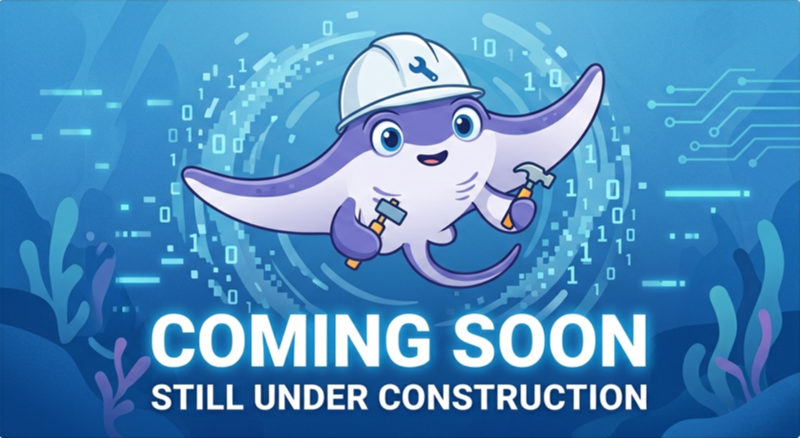

  

# SnapBoard

A small, local-first kanban board from the Snap family.

SnapBoard started life as an Electron experiment. It worked, it shipped, and then it sat around collecting dust for a while.

Now it is back.

## Meet Manta

**SnapBoard Manta** is the revival of SnapBoard as part of the **Snap Ocean Suite**.

Rather than continuing the old Electron codebase, Manta is being rebuilt around the old **StaxKB** project — reworked, rebranded, and given a clearer direction inside the Snap family.

The new version is moving from:

- Electron → **PySide6**
- old SnapBoard prototype → **StaxKB-based rebuild**
- loosely defined experiment → **focused local-first kanban app**

## Current Status

> [!WARNING]
> SnapBoard Manta is currently under active development on a separate branch and is **not ready for normal use yet**.

The `main` branch still contains the old Electron version of SnapBoard.

Older releases are still available if you want to explore the original prototype, but they are **not recommended for everyday use**.

## Need Something Today?

If you actually need a planning tool right now, there are better options.

For scheduling and calendar-style planning:

- [SchedPlus](https://github.com/ZFordDev/SchedPlus)

For a dedicated kanban board:

- [Kanri](https://github.com/kanriapp/kanri)

SnapBoard Manta will join them when it is ready. 🌊

## What SnapBoard Is

The direction remains simple:

- local-first
- lightweight
- offline-friendly
- multiple boards
- flexible columns
- drag-and-drop cards
- simple personal workflow management
- no requirement for a cloud account

The goal is not to build a giant project-management platform.

It is just a good little kanban board.

## The Old SnapBoard

The original SnapBoard was built with Electron and included:

- multiple boards
- dynamic columns
- drag-and-drop cards
- Markdown card content
- file attachments
- JSON-based local storage

That version remains available through the repository history and GitHub Releases.

It is now considered the **prototype generation** of SnapBoard rather than the future of the project.

## License

SnapBoard is released under the MIT License.

See [`LICENSE`](LICENSE) for details.

---

Part of the **Snap Ocean Suite** 🌊  
Built by [ZFordDev](https://github.com/ZFordDev)
